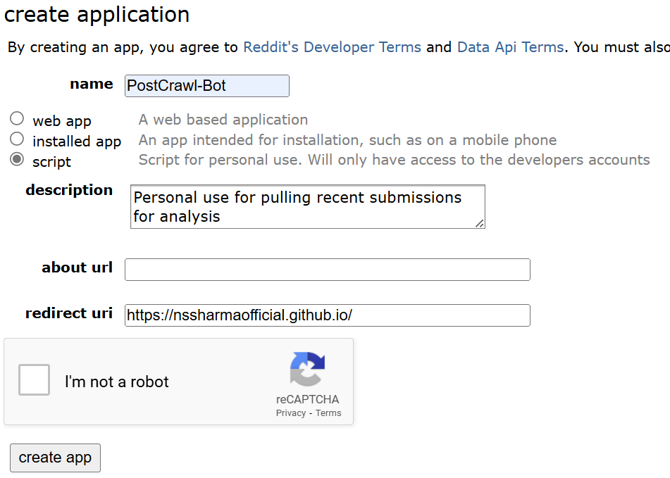
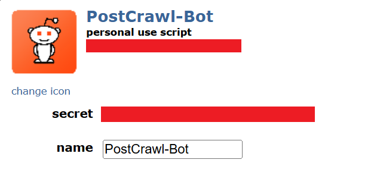

# reddit-hole 🐰


**Let me ask you:**

- 🙋 Would you like to start uploading the trendy Reddit videos on some platform too? 
- 😨 Are you overwhelmed by the existing solution of [RedditVideoMakerBot](https://github.com/elebumm/RedditVideoMakerBot) as it lacks readability and it is hard to modify it on your own?
- 😴 Are you tired of debugging all the issues of the simpler version of it [YoutubeAutomation-Reddit](https://github.com/aahashemi/YouTubeAutomation-Reddit/tree/main)?

**If you replied ⭐ *yes* ⭐ to any of the question above, this is the right place for you! Why this project stands out?**

- 😏 option to choose from creating long "storymode" videos with captions or shorts with the comments' screenshots
- 📒 proper code documentation and readability
- ✅ keeping it simple but configurable (easy to contribute!)

## Examples 🎥

👉 [long "storymode" video](https://www.youtube.com/watch?v=5CCY67G0FBg&t=24s)

👉 [shorts](https://www.youtube.com/shorts/bmCKxse31s8)

## File structure

```plaintext
reddit-hole/
├── assets/
│   ├── background/
│   ├── fonts/
│   ├── temp/
│   ├── config.toml
│   ├── cookie-dark-mode.json
│   ├── cookie-light-mode.json
│   ├── database.json
│   └── my_title_template.png
├── docs/
├── env/
├── results/
│   ├── long/
│   ├── short/
├── utils/
│   ├── captions.py
│   ├── helpers.py
│   ├── reddit.py
│   ├── tts.py
│   └── videomaker.py
├── .env
├── .gitignore
├── LICENSE
├── main.py
├── README.md
└── requirements.txt
```

## Installation 👨‍💻

1. Clone this repository
1. Create virtual environment and install all dependencies

   ```bash
   python -m venv env
   source env/bin/activate
   pip install -r requirements.txt
   python -m playwright install and python -m playwright install-deps
   ```
1. Create `.env` file to store environment variables
1. Setup [AWS (Free Tier)](https://aws.amazon.com/)
   - Sing in to the console
   - Create **access key** and save it along with the **secret access key**
   - Save it in the `.env` file

      ```.env
      # .env
      AWS_ACCESS_KEY_ID=
      AWS_SECRET_ACCESS_KEY=
      AWS_REGION_NAME=
      ```

1. Go to [Reddit App Preferences](https://www.reddit.com/prefs/apps) and click on create another app at the bottom.
   - Fill out the required details, make sure to select **script** and click on create app.

     

   - Make a note of the **personal use script** and  **secret token** and update the the following credentials in the `config.toml` file. 

     

   - Save it in the `.env` file along with your credentials:

      ```.env
      # .env
      REDDIT_CLIENT_ID=
      REDDIT_CLIENT_SECRET=
      REDDIT_USERNAME=
      REDDIT_PASSKEY=
      ```
1. Download any YouTube video as a background
   - Here are a few options:
      - [Minecraft (1:20 h)](https://youtu.be/n_Dv4JMiwK8) 
      - [GTA (1:00 h)](https://youtu.be/qdvjZ1bUw68) 
      - [Subway Surfer (1:05 h)](https://youtu.be/ChBg4aowzX8)
   - Save the path in the `.env` file:

      ```.env
      # .env
      BACKGROUND="/reddit-hole/assets/background/minecraft.mp4"
      ```

1. Setup configuration in [config](/assets/config.toml):

   ```.toml
   [Reddit]
   subreddit='AskReddit'

   [settings]
   storymode=false
   opacity = 0.75
   resolution_w = 1920
   resolution_h = 1080
   pause=0.6
   multiple_voices=false
   voice_id='Matthew'
   ```

   Specifically for comments mode (`storymode=false`):

      ```.toml
      [Reddit]
      topn_comments=10
      max_comment_length=300
      min_comment_length=10

      [settings]
      total_video_duration=59
      theme="dark"
      zoom = 1.25
      ```

All we are left do is run:

```bash
python main.py
```
